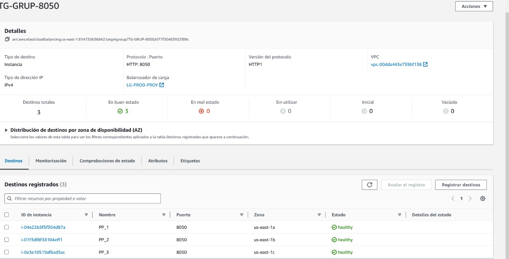

# ProyectoParcial-CC
## Tema
En el presente proyecto, hemos desarrollado una aplicación web centrada en proporcionar una plataforma para que los usuarios expresen críticas y opiniones sobre películas. Esta aplicación ofrece un sistema de autenticación basado en correo electrónico, nombre de usuario y contraseña para que los usuarios puedan registrarse e iniciar sesión.

La funcionalidad determinante de la aplicación se basa en un sistema CRUD (Crear, Leer, Actualizar y Eliminar) en la sección de comentarios. Los usuarios tienen la capacidad de crear comentarios o reseñas sobre películas, editarlas y eliminarlas si lo desean. Además, se ha implementado un sistema de calificación de estrellas que permite a los usuarios asignar una calificación de 1 a 5 estrellas a las películas y calcular así un promedio de calificación para cada película.

La aplicación también incluye un reproductor de video que permite la reproducción de trailers de películas específicas. Adicionalmente, hemos incorporado una sección de "Favoritos" donde los usuarios pueden guardar sus películas preferidas para acceder fácilmente a ellas en el futuro.

En resumen, nuestra aplicación web ofrece una plataforma completa y funcional para que los amantes del cine compartan sus opiniones, califiquen películas y disfruten de contenido multimedia relacionado con el cine.

## API 1: Comments
Este microservicio se encarga de conectarse a la BD, asimismo, crea diferentes URL para recuperar, añadir, eliminar y actualizar los comentarios del usuario, es decir, es nuestro sistema CRUD.
- Recuperar : **/comments/:peliculaId**
- Añadir : **/comments**
- Eliminar : **/comments/:peliculaId/:usuarioId**
- Actualizar **/comments/:peliculaId/:usuarioId**

## API 2: Media
Este microservicio se encarga de conectarse a la BD y realizar distintas tareas, tales como:
- Recupera el id y el link del video que se incluira en el HTML correspondiente al reproductor: **/media/\<int:id>**
- Recupera el id, titulo, poster, likes y rating de la pelicula correspondiente para que se visualice en la vista previa : **/skinners**
- Esta ruta se usara al momento de buscar una pelicula en especifico en la barra de busqueda : **/search**

## API 3: Preferences 
Se conecta a la base de datos y realiza esta tarea en base a esta ruta:
- Recupera las peliculas favoritas del usuario en concreto : **/preference/\<int:id_account>**

## Website:
Este microservicio se encarga del frontend y de realizar los registros, login y logout del usuario, asi como la recuperacion de peliculas y comentarios
- Login : **/signin**
- Registro : **/signup**
- Cerrar Sesion : **/logout**
- Visualizar primera pagina : **/home**
- Recupera las peliculas : **/movies**
- Recupera los comentarios de los usuarios : **/coment**

## Diagrama de Solución
 

    

 

En este diagrama podemos visualizar la estructura en la que nuestras 3 maquinas virtuales estan enlazadas y siendo gestionadas a traves de un "Load Balancer", cada una ha sido lanzada en zona de disponibilidad diferente. Asimismo, cada maquina virtual corre los 4 contenedores y cada uno con un puerto diferente. Por otro lado, tenemos nuestra base de datos basada en PostgreSQL que esta siendo administrada y mantenida a traves de un RDS y que se conecta directamente con nuestros contenedores a traves del puerto 5432 (por defecto de PostgreSQL). Cabe resaltar que las credenciales son las siguientes.
- Nombre de usuario maestro: postgres
- Contraseña maestra: BUYBKZ7G5c1Mmh1Gg9xX
- Punto de enlace: database-1.chduhfhuptun.us-east-1.rds.amazonaws.com

Luego, nuestro sitio web esta siendo cargada y administrada por el microservicio de Flask. Finalmente, cada maquina virtual se encuentra en la region de Ohio, USA lo cual nos permitira una mayor latencia y respuesta de las peticiones que se le pida a la aplicacion web.

##Evidencias

1. Maquinas Virtuales
 

    

 

2. Grupos de destino
 

    

 

3. TG-8050
 

    

 

4. Pagina Web
 

    

 
